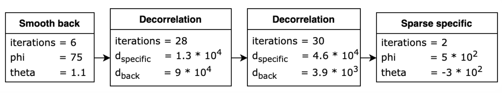

<p align="center">

</p>

<h2 align="center">
AutoTM
</h2>

<p align="center">
    <a href="https://www.repostatus.org/#active">
    
    </a>
    
    <a href="https://opensource.org/licenses/BSD-3-Clause">
    
    </a>
    <a href="https://badge.fury.io/py/autotm">
    
    </a>
    <a href="https://autotm.readthedocs.io/en/latest/?badge=latest">
    
    </a>
    <a href="https://pepy.tech/project/autotm">
    
    </a>
</p>

:sparkles:**News**:sparkles: We have fully updated our framework to AutoTM 2.0 version enriched with new functionality! Stay tuned!

Automatic parameters selection for topic models (ARTM approach) using evolutionary and bayesian algorithms. 
AutoTM provides necessary tools to preprocess english and russian text datasets and tune additively regularized topic models.

## What is AutoTM?
Topic modeling is one of the basic methods for a whole range of tasks:

* Exploratory data analysis of unlabelled text data
* Extracting interpretable features (topics and their combinations) from text data 
* Searching for hidden insights in the data

While ARTM (additive regularization for topic models) approach provides the significant flexibility and quality comparative or better that neural 
approaches it is hard to tune such models due to amount of hyperparameters and their combinations. That is why we provide optimization pipelines to efortlessly process custom datasets.

To overcome the tuning problems AutoTM presents an easy way to represent a learning strategy to train specific models for input corporas. We implement two strategy variants:

* fixed-size variant, that provides a learning strategy that follow the best practices collected from the manual tuning history


* graph-based variant with more flexibility and unfixed ordering and amount of stages (**New in AutoTM 2.0**). Example of pipeline is provided below:

<p align="center">

</p>

Optimization procedure is done by genetic algorithm (GA) which operators are specifically tuned for the each of the strategy creation variants (GA for graph-based is **New in AutoTM 2.0**). Bayesian Optimization is available only for fixed-size strategy. 

To speed up the procedure AutoTM also contain surrogate modeling implementation for fixed-size and graph-based (**New in AutoTM 2.0**) learning strategies that, for some iterations, 
approximate fitness function to reduce computation costs on training topic models.

<p align="center">
    
</p>

AutoTM also propose a range of metrics that can be used as fitness function, like classical ones as coherence to LLM-based (**New in AutoTM 2.0**).

## Installation

! Note: The functionality of topic models training is available only for linux distributions.

Via pip:

```pip install autotm```

From source:

```pip install -r requirements.txt```  

```python -m spacy download en_core_web_sm```

```export PYTHONPATH="${PYTHONPATH}:/path/to/src"```

[//]: # (## Dataset and )

## Quickstart

Start with the notebook:

- [Easy topic modeling with AutoTM](https://github.com/aimclub/AutoTM/blob/main/examples/autotm_fit_predict.py)

## Running from the command line

To fit a model:
```autotmctl --verbose fit --config conf/config.yaml --in data/sample_corpora/sample_dataset_lenta.csv```

To predict with a fitted model:
```autotmctl predict --in data/sample_corpora/sample_dataset_lenta.csv --model model.artm```

 
## Citation

```bibtex
@article{10.1093/jigpal/jzac019,
    author = {Khodorchenko, Maria and Butakov, Nikolay and Sokhin, Timur and Teryoshkin, Sergey},
    title = "{ Surrogate-based optimization of learning strategies for additively regularized topic models}",
    journal = {Logic Journal of the IGPL},
    year = {2022},
    month = {02},
    issn = {1367-0751},
    doi = {10.1093/jigpal/jzac019},
    url = {https://doi.org/10.1093/jigpal/jzac019},}

```
